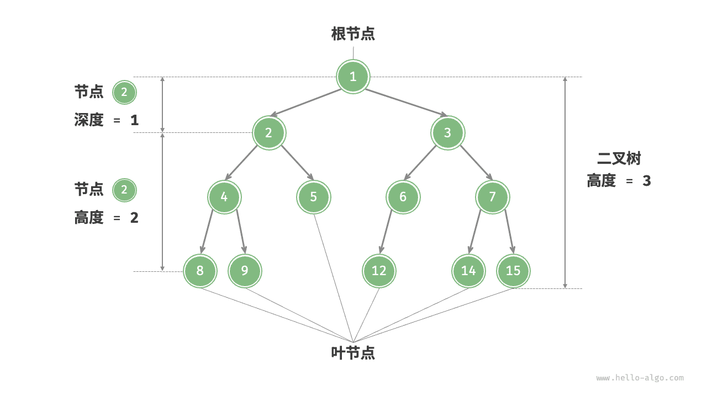
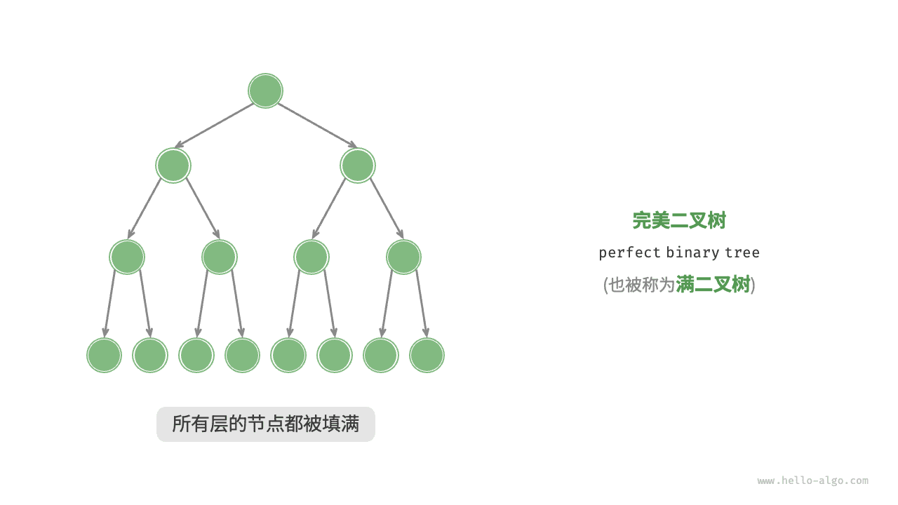
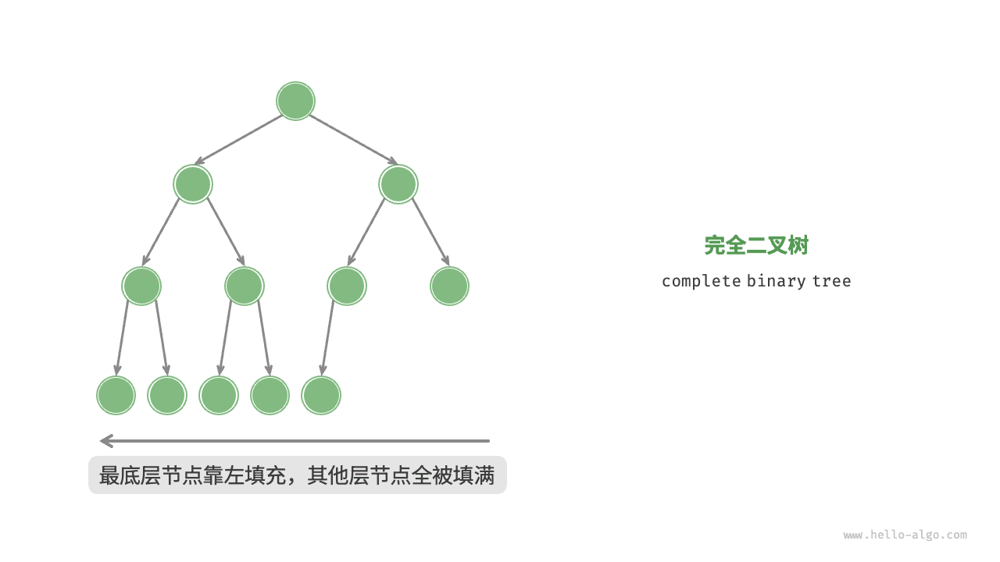
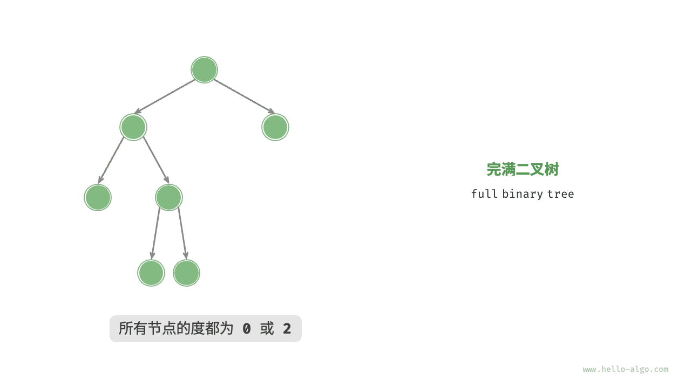
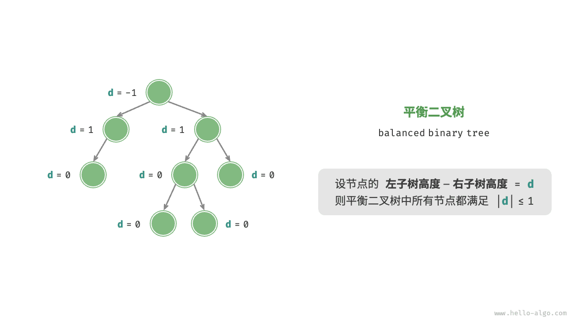
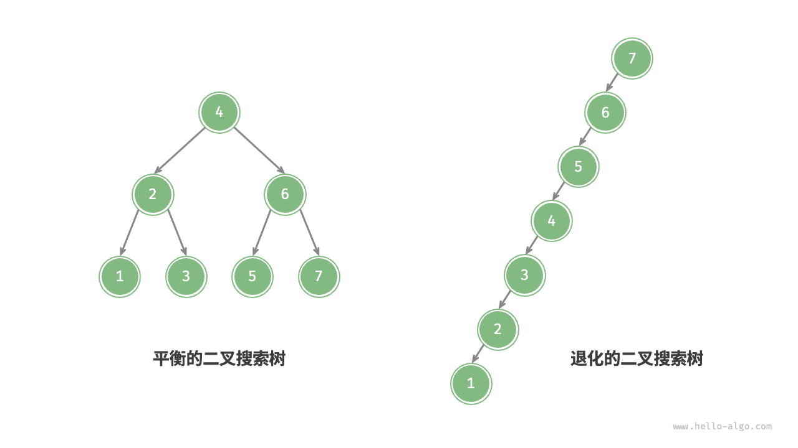
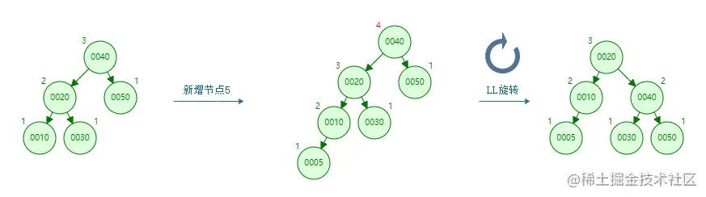
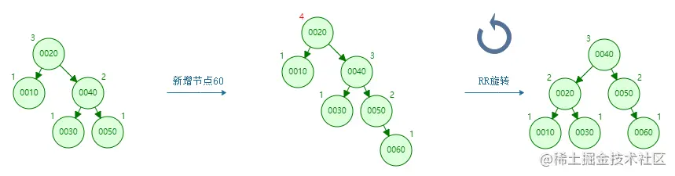
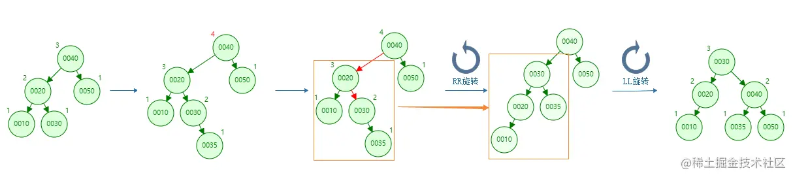
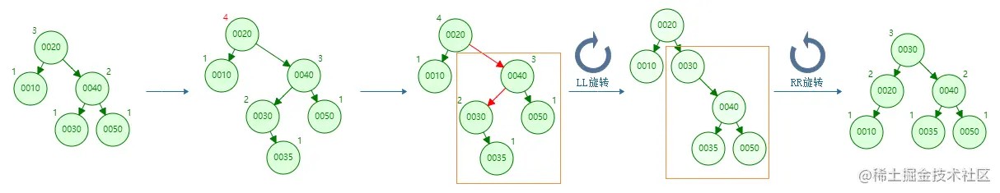

# 树

## 树的分类

> 一个节点具有 `左叶子` 、 `右叶子` 节点，即 二叉树

概念: 根节点、叶节点、边、层、度（节点的子节点数量，0、1、2）、树高度、深度、节点高度

* 满二叉树

n层，共有 ` 2^(2n+1) - 1` 个节点

* 完全二叉树

* 完满二叉树

> 除了叶节点之外，其余所有节点都有两个子节点

* `平衡二叉树`

## 二叉搜索树(BST)

> 对于任意节点， `左子树的所有节点的值 < 当前节点的值 < 右子树所有节点的值`

理想情况下，树是 `平衡` 的，就能在 `logn` 轮循环中查找节点。如果我们在二叉搜索树中不断地插入和删除节点，可能导致二叉树退化为链表，这时各种操作的时间复杂度也会退化为 n。

所以引出了 `平衡二叉搜索树`

## 平衡二叉搜索树(AVL)

> 任意一个节点的 左子树 和 右子树 高度差 <= 1

合理的 左右子树的 高度差，应该在 -1, 0, 1 三者中，否则需要执行平衡操作

### 造成失衡的四种情形及其解决办法:

> 插入后高度差为 2，-2

* 1）`LL失衡`: 向 左侧子树 的 左叶子节点 插入新节点

* 2）`RR失衡`: 向 右侧子树 的 右叶子节点 插入新节点

* 3）`LR失衡`: 向 左侧子树 的 右叶子节点 插入新节点

* 4）`RL失衡`: 向 右侧子树 的 左叶子节点 插入新节点

